This Readme is inspired by [this](https://www.youtube.com/watch?v=xb7AD9u1sNU&list=WL&index=57) session (Arabic session) 

* مرحلة أو دورة = sprint

## Agile main principles
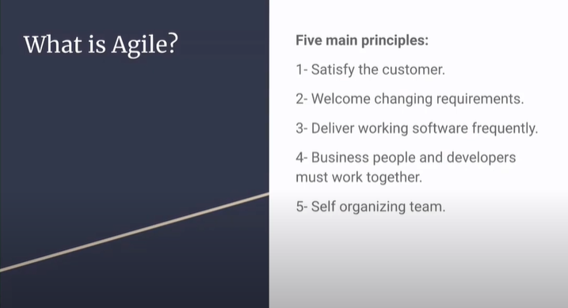 
1. إرضاء العميل, إبقاؤه على إطلاع مع ذكر كافة المشاكل العرضية التي قد تحدث
2. الترحيب بالتغييرات الدورية, إنجاز المتطلبات الجديدة وعدم الإصرار على التصاميم السابقة التي قد لا تلبي الاحتياجات كاملة
3. تسليم المشروع على مراحل, بحيث تكون كل مرحلة سليمة تماماً قبل الانتقال للمرحلة التي تليها تجنباً للمفاجاّت
4. أهم نقطة: ضرورة أن يعمل المطورون جنباً إلى جنب مع العملاء بحيث لا يقوم المطور ببناء أمور لا ترضي العميل أو تكون عكس رغبته
5. من نتائج الاستخدام السليم لتقنية الأجايل هو التنظيم الفردي لكل مطور واستغلاله الوقت بشكل جيد بأقل عدد ممكن من العقبات
(يوجد تعقيب لاحق على هذه النقطة)

## Scrum
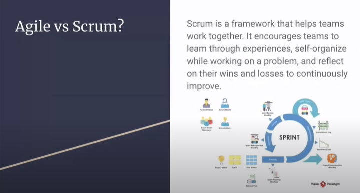 

## Agile vs Waterfall
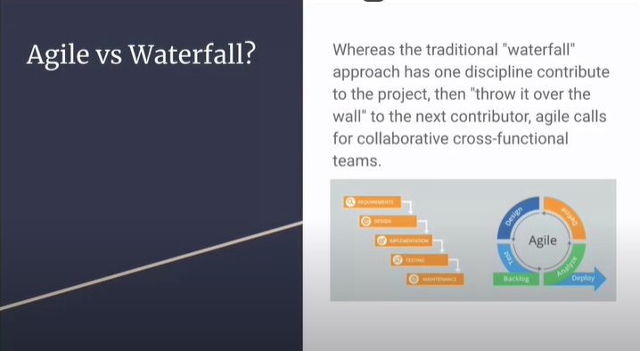 
<b>Waterfall</b>: نبدأ بحصر متطلبات العميل ثم التصميم بعد ذلك التطوير والاختبار من ثم الإطلاق كل ذك بشكل متتالي 
مناسبة للمشاريع التي تكون فيها قرارات العمل واضحة ولا يوجد تغييرات كثيرة 
في هذا النموذج تظهر النتائج في النهاية فقط. 
<b>Agile</b>: التسليم كما أسلفنا على شكل مراحل وبالتالي يكزن مرناً تجاه التغييرات الدورية 
كذلك التسليم الدوري يسمح بإبقاء العميل على إطلاع باّخر المستجدات. 

## Why Agile
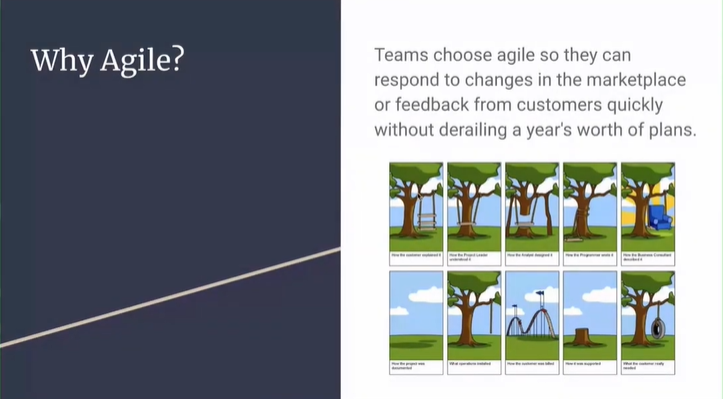 
نستخدم الأجايل تجنباً لتشتت أفكار أعضاء الفريق والإبقاء على الأفكار موجهةً بشكل صحيح لخدمة المشروع 
تسليم المشروع على شكل مراحل يساهم جداً في تجنب تشتت وتباعد الأفكار بين أعضاء الفريق. 

## How to Agile?
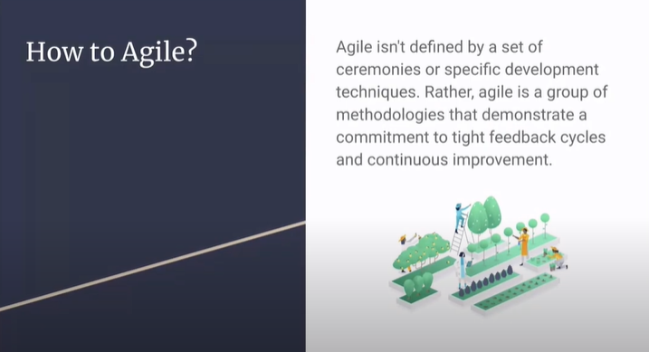 
أجايل ليست قواعد ثابتة صارمة, بل هي منهجية يمكن لكل فريق تكيفها بناء على متطلبات المشروع والعميل بحيث نصل لنتيجة مرضية.

## Scrum roles
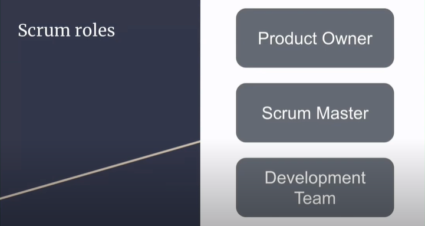 
1. `product owner`: المسؤول عن المتطلبات الأساسية للنظام, وهو أكتر شخص يعرف متطلبات المشروع
2. `scrum master (project manager)`: هو من يدير الفريق, هو من يضع التقديرات الزمنية لإنجاز كل مرحلة من المشروع, أيضاً المسؤول عن إدارة الميزات الجديدة بالمشروع ومسؤول عن التواصل مع فريق المطورين
3. `development team`

## Scurm artifacts
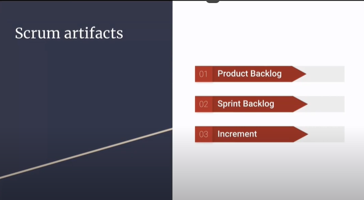 
- each feature is `~user story~`
- `user_story`: شرح عن الميزة ولها أسس للكتابة من بداية التطوير ثم الاختبار انتهاءاً بالتسليم
1. `product backlog`: كل الميزات التي أحتاجها لإنجاز هذا المشروع. 
كل ميزة يجب أن تكون قابلة للقياس و محددة بوقت. 
2. `sprint backloag`: دورة (مرحلة) من دورات تنفيذ المشروع, تقدر بأسبوعين إلى ثلاثة أسابيع
3. `increment`: بعد كل مرحلة (sprint) يوجد مراجعة لكل ما بنيناه في الsprint 
الملاحظات من كل sprint يتم مراجعتها في هذه المرحلة وإضافتها للsprint التالية 

## Scrum ceremonies (مراسم ومراحل)
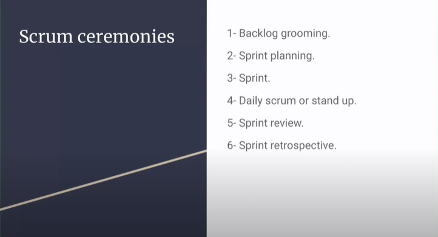 
1. `backlog grooming`: كتابة الميزات ومناقشتها وتحليلها والتفاعل مع الEpics
2. `sprint planning`: ببداية كل أسبوع نخطط لأسبوعين قادمين وهي مدة الsprint 
3. `sprint`: معروفة
4. `daily scrum or stand up`: أهداف اليوم: عبارة عن bugs, tests, coding... 
ذات وقت قصير
5. `sprint review`: هو عبارة عن demo مع العميل
6. `sprint retrospectie`: feedback 
ماهي الدروس المستفادة من هذه المرحلة؟ 
وماهي الأخطاء التي يجب عدم تكرارها؟ 
كل عضو من أعضاء الفريق يبدي رأيه بحوالي خمس دقائق ومن ثم نختم المرحلة الحالية 

ثم بداية الأسبوع المقبل تبدأ مرحلة جديدة وهكذا.

## example
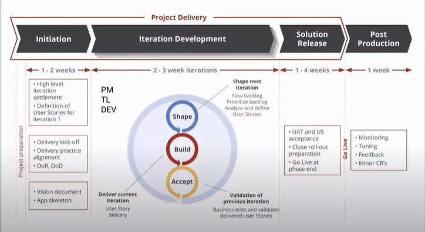

## Agile values
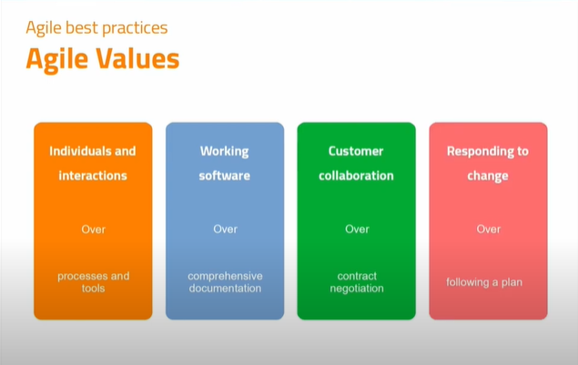

## Agile frameworks
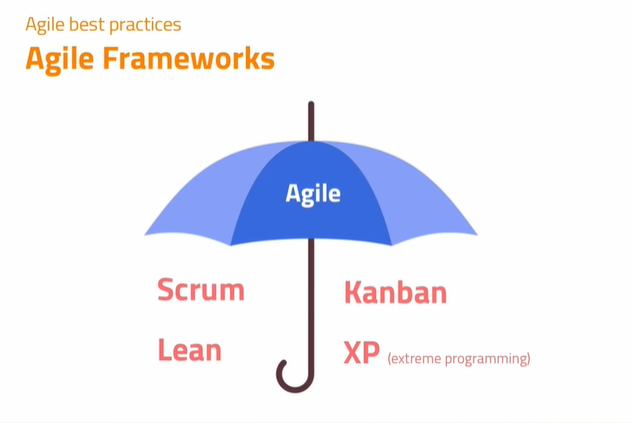
most common frameworks:
1. Scurm
2. Kanban
3. Lean
4. XP (extreme programming)

## Kanban
عبارة عن مجموعة من الألواح بحيث ينتقل التاسك من سبورة إلى أخرى 
يخدم موضوع الدعم الفني بعد تسليم المشروع.

## Kanban vs Scrum
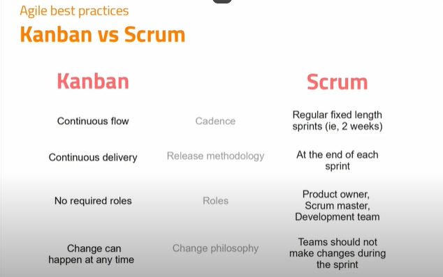

## Agile Workflow
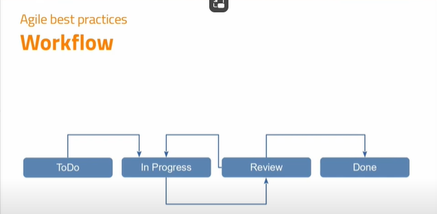

## Automation
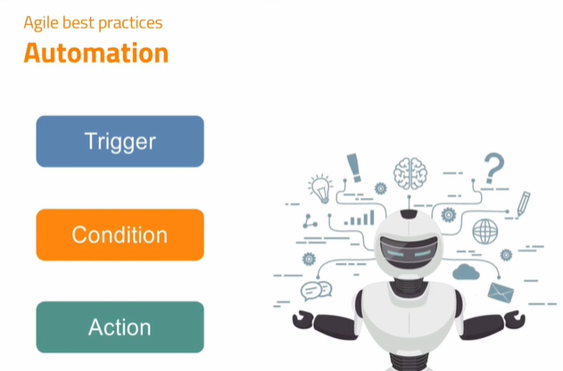 
يجب العودة إليه

## Jira issue hierarchy
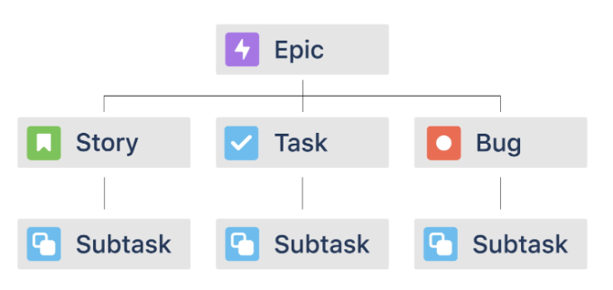

